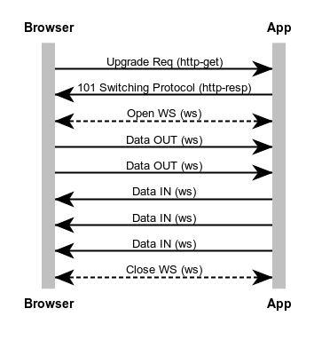
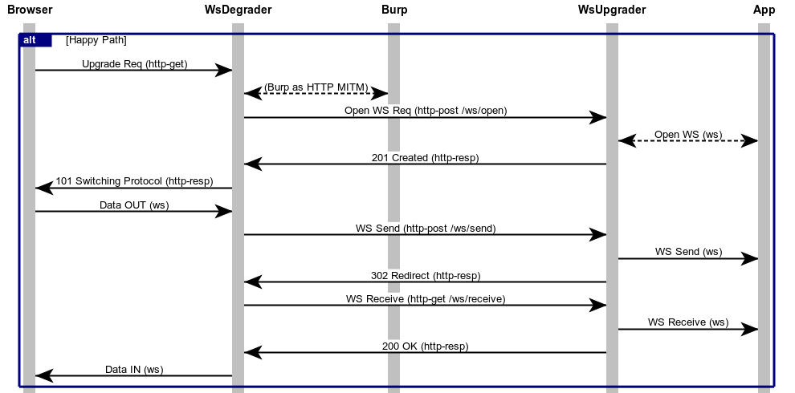
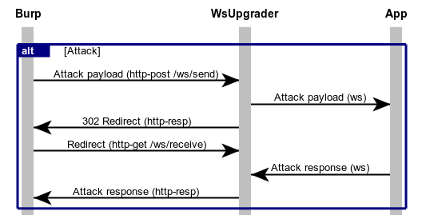

# README for WEBSOCKET-BURP

This app starts-up a front-end websocket degrader (ws-degrader.js) so that we can downgrade websocket traffic to HTTP and then later reupgrade it by using a REST API (in ws-upgrader.js). The upgrade app is based on ExpressJS and includes a test web app at http://localhost/tester.html.

The whole reason to downgrade to HTTP is to be able to insert an HTTP fuzzer
like Burp or OWASP ZAP in the loop for fuzzing purposes.

Lastly, a test websocket app (ws-test-app) is included to test the whole chain.

## Proxy chaining used

### Normal WebSocket Sequence

Normally, the browser would upgrade from HTTP to WebSocket using these kinds of interactions:


### Proxied WebSocket Sequence

This app implements this proxy chaining to allow insertion of Burp into the mix, as an HTTP MITM to allow attacks:

Browser --> ws-degrader --> Burp(front) --> ws-upgrader --> Burp(back) --> Target App

A happy path sequence would look like this (with Burp behind the ws-degrader):


### Attack Sequence

After getting normal payloads using the happy path, then Burp can use the good payloads and fuzz them to attack the app:


## Default Ports

The following ports are used (by default):

-   Port DOCKER_HOST:8081 for Burp listening (on the host, using a non-loopback interface)
-   Port 127.0.0.1:8082 for ws-degrader
-   Port 127.0.0.1:8083 for ws-upgrader
-   Port 127.0.0.1:8084 for ws-test-app

## Running with Docker

Run this app using these commands:

```bash
# Build with default URL values
$ ./build-image.sh
+ docker-build.sh --build-arg HTTP_PROXY_URL=http://192.168.9.125:8081 --build-arg TARGET_APP_URL=http://127.0.0.1:8084
docker build --build-arg HTTP_PROXY_URL=http://192.168.9.125:8081 --build-arg TARGET_APP_URL=http://127.0.0.1:8084 -t websocket-burp .
[...]

# Run with specific URL values
$ ./run-container.sh
+ docker-run.sh -e HTTP_PROXY_FRONT=http://192.168.9.125:8081 -e HTTP_PROXY_BACK=http://192.168.9.125:8081 -e NODE_TLS_REJECT_UNAUTHORIZED=0 -e TARGET_APP_URL=http://127.0.0.1:8084
docker run -it --rm -p 127.0.0.1:8082-8084:8082-8084 --mount type=bind,source="$PWD",target=/app -e HTTP_PROXY_FRONT=http://192.168.9.125:8081 -e HTTP_PROXY_BACK=http://192.168.9.125:8081 -e NODE_TLS_REJECT_UNAUTHORIZED=0 -e TARGET_APP_URL=http://127.0.0.1:8084 --name websocket-burp websocket-burp
TARGET_APP_URL=http://127.0.0.1:8084
WSU_PORT=8083
NODE_VERSION=13.6.0
HOSTNAME=2095ea74f592
YARN_VERSION=1.21.1
HOME=/home/node
HTTP_PROXY_BACK=http://192.168.9.125:8081
NODE_TLS_REJECT_UNAUTHORIZED=0
HTTP_PROXY_FRONT=http://192.168.9.125:8081
TERM=xterm
WTA_PORT=8084
PATH=/usr/local/sbin:/usr/local/bin:/usr/sbin:/usr/bin:/sbin:/bin
WSD_PORT=8082
PWD=/app
(node:9) Warning: Setting the NODE_TLS_REJECT_UNAUTHORIZED environment variable to '0' makes TLS connections and HTTPS requests insecure by disabling certificate verification.
audited 375 packages in 3.156s

2 packages are looking for funding
  run `npm fund` for details

found 0 vulnerabilities


> websocket-burp@0.0.1 start /app
> nodemon --ignore logs/ --ignore data/ --ignore public/tmp app.js

[nodemon] 2.0.2
[nodemon] to restart at any time, enter `rs`
[nodemon] watching dir(s): *.*
[nodemon] watching extensions: js,mjs,json
[nodemon] starting `node app.js`
info: WSP: App websocket-burp is starting...
info: Target App URL: http://127.0.0.1:8084 (valid)
info: WSD: Using front proxy server http://192.168.9.125:8081
debug: WSD: Created proxy server with options: {"target":"http://127.0.0.1:8084","agent":{"secureProxy":false,"proxy":{"protocol":"http:","slashes":true,"auth":null,"host":"192.168.9.125","port":8081,"hostname":"192.168.9.125","hash":null,"search":null,"query":null,"href":"http://192.168.9.125:8081/"}},"prependPath":true}
info: WSD: WebSocket Degrader Reverse Proxy Server at http://127.0.0.1:8082 fronting the target app at http://127.0.0.1:8084
info: WSU: Using back proxy server http://192.168.9.125:8081
warn: WSU: Exception trying to create /app/logs/: EEXIST: file already exists, mkdir '/app/logs/'
warn: WSU: Exception trying to create /app/data: EEXIST: file already exists, mkdir '/app/data'
info: WTA: Starting Test App at http://127.0.0.1:8084/wstester.html
info: WSP: WS-Upgrader started. Tester at http://127.0.0.1:8083/tester.html
info: WSU: Cannot receive from Websocket: Closed
info: WSU: Checking websocket status.
info: WSU: Status: Closed
info: WSU: Getting websocket stats.
info: WSU: Stats: {"op":"stats","received":0,"sent":0,"queued":0}
info: WSU: Cannot receive from Websocket: Closed
info: WSU: Checking websocket status.
info: WSU: Status: Closed
info: WSU: Getting websocket stats.
info: WSU: Stats: {"op":"stats","received":0,"sent":0,"queued":0}
info: WSU: Cannot receive from Websocket: Closed
info: WSU: Checking websocket status.
info: WSU: Status: Closed
info: WSU: Getting websocket stats.
info: WSU: Stats: {"op":"stats","received":0,"sent":0,"queued":0}
info: WSU: Cannot receive from Websocket: Closed
info: WSU: Checking websocket status.
info: WSU: Status: Closed
info: WSU: Getting websocket stats.
info: WSU: Stats: {"op":"stats","received":0,"sent":0,"queued":0}
debug: WTA: Test App received a request for /
debug: WTA: Test App received a request for /jquery.min.js
debug: WTA: Test App received a request for /style.css
debug: WSD: HTTP upgrade event
debug: WSD: Emitting connection event
debug: WSD: WS connection event
info: WSD: Sending WS open request to ws-upgrader
debug: WSD: Sending POST request to http://127.0.0.1:8083/ws/open with body {"url":"http://127.0.0.1:8084"}
info: WSU: Websocket open for http://127.0.0.1:8084 with queueing=undefined
info: WSD-IN: {"op":"open"}
info: WSU: Websocket open confirmed
debug: WSD: WS message event (string): {"type":"event","message":"Just a test!","wsSendTime":"2020-01-20T20:51:02.899Z"}
info: WSD: Sending WS message to ws-upgrader
info: WSD-OUT: {"type":"event","message":"Just a test!","wsSendTime":"2020-01-20T20:51:02.899Z"}
debug: WSD: Sending POST request to http://127.0.0.1:8083/ws/send with body {"type":"event","message":"Just a test!","wsSendTime":"2020-01-20T20:51:02.899Z"}
debug: WSU: Stringifying body prior to socket insertion
debug: WSU: Websocket message sent
info: WSU-OUT: {"type":"event","message":"Just a test!","wsSendTime":"2020-01-20T20:51:02.899Z"}
debug: WTA: Test App Received: {"type":"event","message":"Just a test!","wsSendTime":"2020-01-20T20:51:02.899Z"}
debug: WTA: Test App Echo Msg: {"TYPE":"EVENT","MESSAGE":"JUST A TEST!","WSSENDTIME":"2020-01-20T20:51:02.899Z"}
debug: WSU: Queuing incoming websocket data of type: string
info: WSU-IN: {"TYPE":"EVENT","MESSAGE":"JUST A TEST!","WSSENDTIME":"2020-01-20T20:51:02.899Z"}
info: WSU: Dequeueing message of type string
info: WSU: Message: {"TYPE":"EVENT","MESSAGE":"JUST A TEST!","WSSENDTIME":"2020-01-20T20:51:02.899Z"}
info: WSD-IN: {"TYPE":"EVENT","MESSAGE":"JUST A TEST!","WSSENDTIME":"2020-01-20T20:51:02.899Z"}
debug: WSD: WS message event (string): {"type":"event","message":"Just a test!","wsSendTime":"2020-01-20T20:51:08.159Z"}
info: WSD: Sending WS message to ws-upgrader
info: WSD-OUT: {"type":"event","message":"Just a test!","wsSendTime":"2020-01-20T20:51:08.159Z"}
debug: WSD: Sending POST request to http://127.0.0.1:8083/ws/send with body {"type":"event","message":"Just a test!","wsSendTime":"2020-01-20T20:51:08.159Z"}
debug: WSU: Stringifying body prior to socket insertion
debug: WSU: Websocket message sent
info: WSU-OUT: {"type":"event","message":"Just a test!","wsSendTime":"2020-01-20T20:51:08.159Z"}
debug: WTA: Test App Received: {"type":"event","message":"Just a test!","wsSendTime":"2020-01-20T20:51:08.159Z"}
debug: WTA: Test App Echo Msg: {"TYPE":"EVENT","MESSAGE":"JUST A TEST!","WSSENDTIME":"2020-01-20T20:51:08.159Z"}
debug: WSU: Queuing incoming websocket data of type: string
info: WSU-IN: {"TYPE":"EVENT","MESSAGE":"JUST A TEST!","WSSENDTIME":"2020-01-20T20:51:08.159Z"}
info: WSU: Dequeueing message of type string
info: WSU: Message: {"TYPE":"EVENT","MESSAGE":"JUST A TEST!","WSSENDTIME":"2020-01-20T20:51:08.159Z"}
info: WSD-IN: {"TYPE":"EVENT","MESSAGE":"JUST A TEST!","WSSENDTIME":"2020-01-20T20:51:08.159Z"}
info: WSD: Sending WS close request to ws-upgrader
debug: WSD: Sending POST request to http://127.0.0.1:8083/ws/close with body {}
debug: WSD: WS close event
info: WSU: Closing websocket.
info: WSU: Websocket close confirmed. Code: 1005
info: WSD-IN: {}
```
